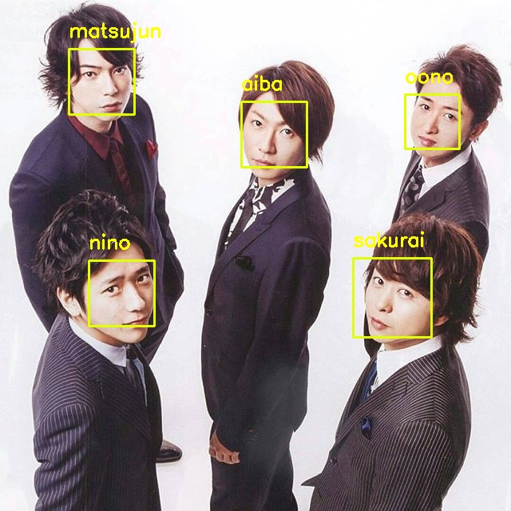
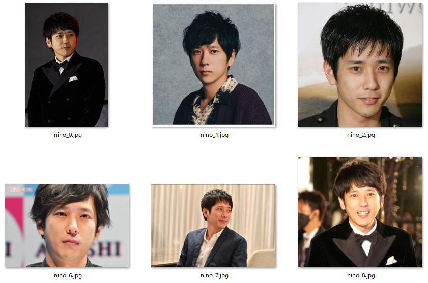
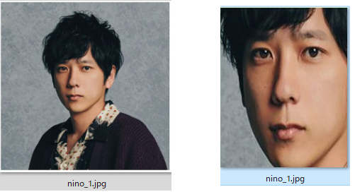
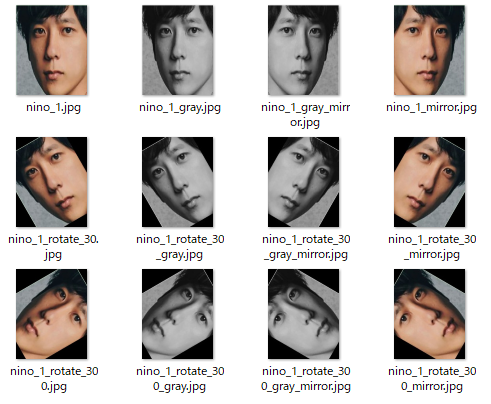

# face_recognitionによる顔画像認識



<br>

## 環境構築方法

- pip コマンドで、必要なパッケージをインストールする。
  > pip install -r ./requirements.txt

<br>

## 操作方法

<br>

### 01.データ収集

- ChromeとSeleniumを使用して、モデルデータを作成するための画像データを収集する。

- 以下のコマンドを実行すると、入力欄が表示されるので、検索ワード、人物ラベル(半角英字)、取得画像枚数を指定する。

  > python 01_get_model_data.py

  ```bash
  input query keyword:二宮         # ← 検索ワードを入力
  input label:nino                 # ← 人物ラベル。検出した顔画像に表示されます
  input number of get_model:20     # ← 取得画像枚数。20枚程度推奨。
  ```

- `./model_rawdata` ディレクトリに、人物ラベルのディレクトリが作られ、取得した画像が格納される。

  

<br>

### 02.顔画像切り出し

- 収集した画像から特徴が明確になるように、顔部分だけを取り出した画像を作成する。

- 以下のコマンドを実行すると、`./model_rawdata` ディレクトリ内のすべての画像に対して、自動でトリミングが行われる。

  > python 02_triming_face.py

- `./model_dataset` ディレクトリに、人物ラベルのディレクトリが作られ、トリミングした結果が格納される。

  

<br>

### 03.モデルデータの水増し

- 深層学習の精度を高めるため、顔画像に以下の加工を施してデータを増産（水増し）する。

  - +30°傾ける

  - -30°傾ける 

  - 灰色にする

  - 左右対称とする

- 以下のコマンドを実行することで、`./model_rawdata` ディレクトリ内のすべての画像に対して、上記の加工が自動で行われる。

- `./model_dataset` ディレクトリに、上記の加工を行った画像が追加される。

  

<br>

### 04.モデル学習

- 以下のコマンドでモデルデータを作成する。   

  > python 04_train_model.py

- 実行するにはかなりの負荷がかかるため、以下いずれかの環境を推奨する。

  - CUDA対応のGPUチップが搭載されたグラボ搭載PC(Nvidia)

  - M1 or M2チップ搭載のMac

  - クラウドGPU環境(Google Colaboratory等)

- 正常に終了した場合は、モデルデータ `encodings.pickle` ファイルが作成される。

<br>

### 05.検出テスト

#### ファイル検出モード（静止画）

  - 以下のコマンドを実行すると、画像からモデルデータ作成した対象者の顔検出を実行する。

    > python 05_detect_face.py \[検出対象の画像ファイル\]

  - 検出した結果は、ディレクトリ「photo_detected」に格納される。検出用のjpg画像の中で、顔と識別された箇所には黄色い□枠が表示され、モデルデータと一致した場合波枠の上部にモデル名が表示される。

    

#### カメラ検出モード（動画）

  - 以下のコマンドを実行すると、PCに接続しているカメラ動画から、モデルデータとして作成した対象者の検出を実行する。

    > python 05_detect_face.py

  - カメラの動画がウィンドウ背面に出る場合があります。
  - プログラムを止めるには、ウィンドウ上で「q」キーを押下してください。
  - ウインドウで「+」「-」キーを押すと「tolerance」値を変更することができ、識別精度が変わります（小さい方がシビアに識別します）


<br>

# memo
- Windows環境でdlibをインストールするには。

  - C++のビルド環境が必要となる。VisualStudio2019が必要。詳しくは[こちら](https://qiita.com/taungyeon/items/0afa3a5580c7521d54d1)を参照のこと。

  - さらに、[こちらのgithub](https://github.com/davisking/dlib)のファイル一式をzipでダウンロードして、setup.pyを実行する。

  > python setup.py install
